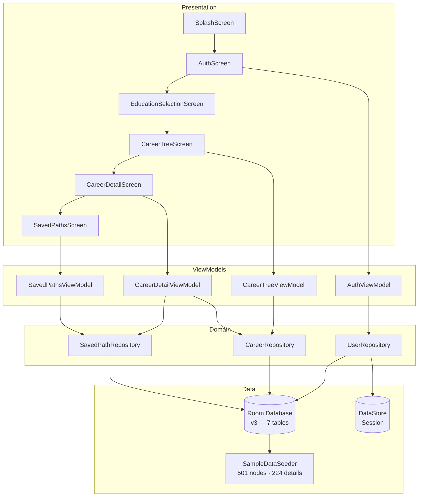

<div align="center">


# Future Guider

### *Explore Your Future, One Step At A Time*

[](https://kotlinlang.org)
[](https://developer.android.com)
[](https://developer.android.com/jetpack/compose)
[](https://m3.material.io)
[](https://developer.android.com/topic/architecture)
[](https://developer.android.com/training/data-storage/room)
[](https://dagger.dev/hilt)
[](LICENSE)

<br/>

**Future Guider** is a production-ready Android application that helps Indian students navigate their career paths through an interactive, expandable career tree explorer. With **501 career nodes**, **32 categories**, and **224 detailed career guides**, it is one of the most comprehensive offline career guidance tools built natively for Android.

[📱 Download APK](#-build-instructions) · [🐛 Report Bug](../../issues) · [✨ Request Feature](../../issues) · [📖 Wiki](../../wiki)

</div>

---

## 📋 Table of Contents

- [Vision & Mission](#-vision--mission)
- [Problem Statement](#-problem-statement)
- [Key Features](#-key-features)
- [Screenshots](#-screenshots)
- [Technology Stack](#-technology-stack)
- [Architecture](#-architecture)
- [Project Structure](#-project-structure)
- [Career Data Overview](#-career-data-overview)
- [Installation](#-installation)
- [Build Instructions](#-build-instructions)
- [Navigation Flow](#-navigation-flow)
- [State Management & Data Flow](#-state-management--data-flow)
- [Database Design](#-database-design)
- [Security](#-security)
- [Performance](#-performance)
- [Roadmap](#-roadmap)
- [Known Limitations](#-known-limitations)
- [Contributing](#-contributing)
- [License](#-license)
- [Author](#-author)
- [Acknowledgements](#-acknowledgements)
- [FAQ](#-faq)
- [Changelog](#-changelog)
- [Support](#-support)

---

## 🎯 Vision & Mission

### Vision
To become India's most trusted offline career guidance platform — empowering every student, regardless of location or internet access, to make informed decisions about their future.

### Mission
Provide a clean, fast, and beautifully designed Android application that maps the full spectrum of Indian career paths — from ITI trades and 10th grade streams all the way to MBA specialisations, professional courses, and emerging fields — entirely offline.

---

## 🚨 Problem Statement

> **Millions of Indian students make career decisions without adequate guidance.**

- Students in tier-2 and tier-3 cities have limited access to professional career counsellors
- Most online career guidance platforms require internet connectivity
- Generic advice doesn't account for the specific education levels of Indian students (10th, 12th Science/Commerce/Arts, Diploma, UG, PG)
- There is no single mobile app that maps the complete Indian education-to-career pathway in an intuitive, interactive format

**Future Guider solves all of these problems — offline, free, and in the student's hands.**

---

## ✨ Key Features

### 🌳 Interactive Career Tree Explorer
- Expandable/collapsible tree structure showing every career path step-by-step
- Lazy loading of child nodes — only loads when a parent is tapped
- Smooth `expandVertically` + `fadeIn` animations on tree expansion
- Visual depth-indentation with connector line indicators
- Colour-coded nodes by career domain

### 🗂️ 32 Education Categories
Covers every major Indian education milestone:

| Academic Streams | Professional Courses | Career Paths |
|---|---|---|
| 10th Passed | Hotel Management | Government Jobs (UPSC/SSC/Banking) |
| 12th Science | Design Courses | Defence & Military |
| 12th Commerce | Architecture | Sports & Fitness |
| 12th Arts | Agriculture | Entrepreneurship |
| Diploma / ITI | Law & Legal | Creative Arts |
| BCA, B.Sc, B.Com | Media & Journalism | Healthcare Allied |
| B.Tech / BE | Paramedical, Aviation | — |
| MBA, B.Ed | Marine, Social Work | — |
| — | Finance & Accounts | — |
| — | Environmental Science | — |
| — | Veterinary, Library Science | — |

### 📚 224 Detailed Career Guides
Each leaf career node contains:
- **Description** — what the career is, industry context, and growth scope
- **Required Skills** — 6 domain-specific skills
- **Practice Projects** — 3 hands-on projects with full descriptions
- **Certifications** — 3 relevant industry certifications with providers
- **Suggested Next Step** — personalised action plan with top colleges and entrance exams

### 🔐 User Authentication
- Register and login with name, email, and password
- Passwords hashed with SHA-256 before storage — plain text never persisted
- Session persisted via Jetpack DataStore — survives app restarts
- Auto-login on relaunch if session is active

### 💾 Save Career Paths
- Save any career to a personal bookmarks list
- Full breadcrumb trail displayed: `10th → Science → PCMC → AI & ML`
- Delete saved paths with swipe or button
- Paths persist across reinstalls via Android Auto Backup

### 🎨 Professional UI/UX
- Material Design 3 with full dark mode and light mode support
- Smooth screen transition animations (slide + fade)
- Grouped education selection with category section headers
- Stats bar: 32 categories · 500+ career paths · 160+ guides
- Animated pulse on splash screen logo
- White brand theme matching the Future Guider shield logo

---

## 📱 Screenshots

> Add screenshots after running the app by replacing the paths below.

| Splash Screen | Education Selection | Career Tree |
|:---:|:---:|:---:|
|  |  |  |

| Career Details | Saved Paths | Login |
|:---:|:---:|:---:|
|  |  |  |

---

## 🛠️ Technology Stack

| Layer | Technology | Version | Purpose |
|---|---|---|---|
| Language | **Kotlin** | 1.9.24 | Primary development language |
| UI Framework | **Jetpack Compose** | BOM 2024.06 | Declarative UI toolkit |
| Design System | **Material Design 3** | Latest | UI components and theming |
| Architecture | **MVVM + Clean Architecture** | — | Separation of concerns |
| Dependency Injection | **Hilt (Dagger)** | 2.51.1 | DI container |
| Local Database | **Room** | 2.6.1 | Structured offline data storage |
| Session Storage | **DataStore Preferences** | 1.1.1 | Lightweight key-value persistence |
| Navigation | **Navigation Compose** | 2.7.7 | Type-safe screen navigation |
| Async | **Kotlin Coroutines** | 1.8.1 | Background threading |
| Reactive State | **StateFlow** | — | Reactive UI state management |
| Annotation Processing | **KSP** | 1.9.24-1.0.20 | Fast compile-time code generation |
| Build System | **Gradle KTS** | 8.4 | Build automation with Kotlin DSL |

---

## 🏗️ Architecture

Future Guider follows **Clean Architecture** principles with **MVVM** as the presentation pattern, divided into three distinct layers:

```
┌─────────────────────────────────────────────────────┐
│                  PRESENTATION LAYER                 │
│   Screens (Compose) → ViewModels → UI State         │
├─────────────────────────────────────────────────────┤
│                   DOMAIN LAYER                      │
│   Models · Repository Interfaces · Use Cases        │
├─────────────────────────────────────────────────────┤
│                    DATA LAYER                       │
│   Room DB · DAOs · Entities · DataStore · Mappers   │
└─────────────────────────────────────────────────────┘
```

### Architecture Diagram



### Layer Responsibilities

| Layer | Responsibility |
|---|---|
| **Presentation** | Compose UI screens, ViewModels, UI state via `StateFlow` |
| **Domain** | Pure Kotlin models, repository interfaces — no Android dependencies |
| **Data** | Room DAOs, entities, DataStore, mapper functions, SampleDataSeeder |
| **DI** | Hilt modules wiring repositories to their implementations |

### Key Design Decisions

- **Repository interfaces** defined in domain — data layer provides implementations injected via Hilt
- **Unidirectional data flow** — ViewModels expose `StateFlow<UiState>`, screens collect and render
- **Mapper functions** — entities ↔ domain models converted at the data boundary, keeping domain pure
- **Lazy tree loading** — child nodes fetched via `Flow` only when a node is expanded, preventing full tree materialisation at startup
- **Single Activity** — `MainActivity` hosts the full `NavHost`, all screens are Compose destinations

---

## 📁 Project Structure

```
FutureGuider/
├── app/
│   ├── src/main/
│   │   ├── kotlin/com/futureguider/
│   │   │   ├── FutureGuiderApp.kt              # @HiltAndroidApp entry point
│   │   │   ├── MainActivity.kt                 # Single activity + NavHost host
│   │   │   │
│   │   │   ├── data/
│   │   │   │   ├── local/
│   │   │   │   │   ├── dao/
│   │   │   │   │   │   ├── UserDao.kt
│   │   │   │   │   │   ├── CareerNodeDao.kt
│   │   │   │   │   │   ├── CareerDetailDao.kt
│   │   │   │   │   │   └── SavedPathDao.kt
│   │   │   │   │   ├── entities/
│   │   │   │   │   │   ├── UserEntity.kt
│   │   │   │   │   │   ├── CareerNodeEntity.kt
│   │   │   │   │   │   ├── CareerDetailEntity.kt
│   │   │   │   │   │   ├── SkillEntity.kt
│   │   │   │   │   │   ├── CertificationEntity.kt
│   │   │   │   │   │   ├── ProjectEntity.kt
│   │   │   │   │   │   └── SavedPathEntity.kt
│   │   │   │   │   ├── FutureGuiderDatabase.kt # Room DB v3, auto-reseeds on open
│   │   │   │   │   ├── Mappers.kt              # Entity ↔ Domain model converters
│   │   │   │   │   ├── SampleDataSeeder.kt     # 501 nodes, 224 detail bundles
│   │   │   │   │   └── UserPreferences.kt      # DataStore session management
│   │   │   │   └── repository/                 # Repository implementations
│   │   │   │
│   │   │   ├── di/
│   │   │   │   ├── DatabaseModule.kt           # Room DB + DAO + migration providers
│   │   │   │   └── RepositoryModule.kt         # Repository interface bindings
│   │   │   │
│   │   │   ├── domain/
│   │   │   │   ├── model/                      # Pure Kotlin domain models
│   │   │   │   └── usecase/                    # Repository interfaces
│   │   │   │
│   │   │   └── presentation/
│   │   │       ├── components/                 # Shared Compose components
│   │   │       ├── navigation/                 # NavHost + Screen sealed class
│   │   │       ├── screens/
│   │   │       │   ├── splash/                 # Animated logo + Get Started/Login
│   │   │       │   ├── auth/                   # RegisterScreen + LoginScreen
│   │   │       │   ├── education/              # 32-category grouped selection
│   │   │       │   ├── careertree/             # Expandable tree explorer
│   │   │       │   ├── careerdetails/          # Skills, certs, projects, next step
│   │   │       │   └── savedpaths/             # Bookmarked career paths
│   │   │       ├── theme/                      # Color, Typography, Shape
│   │   │       └── viewmodel/                  # Auth, CareerTree, Detail, Saved VMs
│   │   │
│   │   └── res/
│   │       ├── drawable/                       # App drawables
│   │       ├── drawable-nodpi/                 # Full-res logo PNG (exact brand asset)
│   │       ├── mipmap-mdpi/                    # 48×48 launcher icon
│   │       ├── mipmap-hdpi/                    # 72×72 launcher icon
│   │       ├── mipmap-xhdpi/                   # 96×96 launcher icon
│   │       ├── mipmap-xxhdpi/                  # 144×144 launcher icon
│   │       ├── mipmap-xxxhdpi/                 # 192×192 launcher icon
│   │       ├── values/                         # strings.xml, colors.xml, themes.xml
│   │       └── xml/                            # backup_rules.xml, data_extraction_rules.xml
│   │
│   └── build.gradle.kts
│
├── gradle/
│   ├── libs.versions.toml                      # Centralised version catalog
│   └── wrapper/
├── build.gradle.kts
├── settings.gradle.kts
├── gradle.properties                           # JVM heap, parallel builds
└── README.md
```

---

## 📊 Career Data Overview

The app ships with a fully seeded offline database:

| Metric | Count |
|---|---|
| Root education / career categories | 32 |
| Total career tree nodes | 501 |
| Leaf careers with full detail guides | 224 |
| Skills documented | 1,344 (6 per career) |
| Certifications documented | 672 (3 per career) |
| Practice projects documented | 672 (3 per career) |
| Seed functions in SampleDataSeeder | 8 |

### Category Groups

| Group | Categories Included |
|---|---|
| **After 10th** | 10th Passed |
| **After 12th** | 12th Science · 12th Commerce · 12th Arts |
| **Diploma / Vocational** | Diploma / ITI |
| **Under Graduate** | BCA · B.Sc · B.Com · B.Tech/BE · B.Ed |
| **Post Graduate** | MBA |
| **Professional Courses** | Hotel Management · Design · Architecture · Agriculture · Law & Legal · Media & Journalism · Paramedical · Aviation · Marine & Merchant Navy · Social Work · Finance & Accounts · Environmental Science · Veterinary Science · Library Science |
| **Career Paths** | Government Jobs · Defence & Military · Sports & Fitness · Entrepreneurship · Creative Arts · Healthcare Allied |

---

## ⚙️ Installation

### Prerequisites

| Requirement | Minimum Version |
|---|---|
| Android Studio | Hedgehog 2023.1.1 or newer |
| JDK | 11 or 17 (bundled with Android Studio) |
| Android SDK | API 34 |
| Minimum Device Android | 5.0 (API 21) |
| Target Device Android | 14 (API 34) |

### Quick Start

```bash
# 1. Clone the repository
git clone https://github.com/yourusername/FutureGuider.git

# 2. Open in Android Studio
# File → Open → select the FutureGuider folder

# 3. Wait for Gradle sync to complete
# First sync downloads ~150 MB of dependencies

# 4. Press ▶ Run (or Shift+F10) to launch on device/emulator
```

---

## 🔨 Build Instructions

### Debug Build
```bash
./gradlew assembleDebug
# APK: app/build/outputs/apk/debug/app-debug.apk
```

### Release Build
```bash
# Step 1 — Generate signing keystore (one-time)
keytool -genkey -v -keystore futureguider.jks \
        -keyalg RSA -keysize 2048 -validity 10000 \
        -alias futureguider

# Step 2 — Build signed release APK
./gradlew assembleRelease
# APK: app/build/outputs/apk/release/app-release.apk
```

### Install on Connected Device
```bash
./gradlew installDebug
```

### Clean Build
```bash
./gradlew clean assembleDebug
```

> **Tip:** Enable **USB Debugging** in Developer Options on your Android device before running `installDebug`.

---

## 🗺️ Navigation Flow

```
App Launch
    │
    └──→ SplashScreen
              │
              ├── [Session active]  ──────────────────→ EducationSelectionScreen
              │
              ├── [Get Started] ──→ RegisterScreen ──→ EducationSelectionScreen
              │
              └── [Login]       ──→ LoginScreen    ──→ EducationSelectionScreen
                                                              │
                                                   [Select education category]
                                                              │
                                                    CareerTreeScreen
                                                    (expandable tree)
                                                              │
                                                   [Tap a leaf career]
                                                              │
                                                    CareerDetailScreen
                                                    Skills · Certs · Projects
                                                    Next Step · Save button
                                                              │
                                                   [View saved paths]
                                                              │
                                                    SavedPathsScreen
```

All screen transitions use **slide + fade** animations configured globally in the `NavHost`.

---

## 🔄 State Management & Data Flow

### Unidirectional Data Flow

```
User Action
    │
    ▼
ViewModel (coroutine scope)
    │
    ▼
Repository Interface (domain)
    │
    ▼
Repository Implementation (data)
    │
    ▼
Room DAO / DataStore
    │
    ▼ (Flow / suspend)
StateFlow<UiState>  ←── ViewModel collects & maps
    │
    ▼
Compose Screen (collectAsStateWithLifecycle)
    │
    ▼
Recomposition → Updated UI
```

### UI State Examples

```kotlin
// CareerTreeViewModel
data class CareerTreeUiState(
    val rootNodes: List<CareerNode> = emptyList(),
    val expandedNodeIds: Set<Int> = emptySet(),
    val childrenMap: Map<Int, List<CareerNode>> = emptyMap(),
    val isLoading: Boolean = true
)

// AuthViewModel
data class AuthUiState(
    val isLoading: Boolean = false,
    val isSuccess: Boolean = false,
    val errorMessage: String? = null
)
```

### Reactive Queries
Room DAOs return `Flow<T>` — all lists update automatically when the underlying database changes, with no manual refresh logic required.

---

## 🗄️ Database Design

Room database `future_guider.db` — **version 3**, 7 tables:

```
users
├── id           INTEGER PK AUTOINCREMENT
├── name         TEXT
├── email        TEXT UNIQUE
├── passwordHash TEXT (SHA-256)
└── createdAt    INTEGER

career_nodes
├── id        INTEGER PK
├── name      TEXT
├── parentId  INTEGER FK → career_nodes.id (NULL for roots)
├── type      TEXT (ROOT | BRANCH | LEAF)
└── colorHex  TEXT

career_details
├── nodeId            INTEGER PK FK → career_nodes.id
├── description       TEXT
└── suggestedNextStep TEXT

skills          → nodeId FK, skillName TEXT
certifications  → nodeId FK, certName TEXT, provider TEXT
projects        → nodeId FK, projectName TEXT, description TEXT

saved_paths
├── id        INTEGER PK AUTOINCREMENT
├── userId    INTEGER FK → users.id
├── leafNodeId INTEGER FK → career_nodes.id
├── pathJson  TEXT (JSON array of node names)
└── savedAt   INTEGER
```

### Migrations

| Version | Change |
|---|---|
| 1 → 2 | Schema unchanged — new career seed data added |
| 2 → 3 | Schema unchanged — additional 14 professional course categories seeded |

### Auto-Reseeding
The database `onOpen` callback triggers `SampleDataSeeder.seed()` which checks `nodeDao.getCount() > 0` and skips if data already exists — ensuring zero duplicate inserts on every app open.

---

## 🔐 Security

| Concern | Implementation |
|---|---|
| Password storage | SHA-256 hashed — plain text never written to disk |
| Session persistence | Jetpack DataStore with typed preference keys |
| Data backup | Android Auto Backup scoped to `future_guider.db` and preferences only |
| SQL injection | Impossible — Room uses compiled parameterised queries exclusively |
| Network exposure | Zero — the app makes no network calls whatsoever |
| Sensitive data | No PII beyond name and email, both stored locally only |

---

## ⚡ Performance

| Optimisation | Detail |
|---|---|
| Lazy tree loading | Child nodes fetched only when a parent is expanded — `O(1)` per tap |
| Flow-based queries | Room emits only on data change — no polling or manual refresh |
| Stable Compose keys | `LazyColumn` uses node ID as key — prevents unnecessary recompositions |
| KSP over KAPT | Kotlin Symbol Processing is 2× faster at compile time |
| Gradle daemon | Persistent Gradle daemon reduces cold build times significantly |
| JVM heap | Set to 4096 MB in `gradle.properties` to prevent GC pauses during large builds |
| Parallel builds | `org.gradle.parallel=true` enables concurrent task execution |

---

## 🛣️ Roadmap

### Version 2.0
- [ ] **Full-text search** across all 501 career nodes
- [ ] **Career Quiz** — interest-based questionnaire suggesting matching careers
- [ ] **Entrance Exam Calendar** — NEET, JEE, CLAT, GATE, UPSC dates and syllabus
- [ ] **College Finder** — top institutions per career with NIRF ranking and fee range
- [ ] **Progress Tracker** — mark career exploration milestones as complete

### Version 3.0
- [ ] **Multi-language support** — Hindi, Kannada, Tamil, Telugu
- [ ] **AI Career Recommendation** — on-device ML for personalised suggestions
- [ ] **Scholarship Database** — central and state government scholarships
- [ ] **Share Career Path** — share your exploration path as an image or link
- [ ] **Daily Career Tips** — notification-based micro-learning

---

## ⚠️ Known Limitations

- English only — regional language support is planned for v2.0
- Career data is static and bundled — no server-side sync in this version
- Salary and live job market data is not available
- College photos and career images are not included
- Requires Android 5.0 (API 21) minimum

---

## 🤝 Contributing

Contributions are welcome and greatly appreciated.

```bash
# 1. Fork the repository on GitHub

# 2. Clone your fork
git clone https://github.com/yourusername/FutureGuider.git

# 3. Create a feature branch
git checkout -b feature/your-feature-name

# 4. Make your changes

# 5. Commit with a descriptive message
git add .
git commit -m "feat: add career search functionality"

# 6. Push and open a Pull Request
git push origin feature/your-feature-name
```

### Guidelines
- Follow the existing Clean Architecture layer structure
- Add new career data in `SampleDataSeeder.kt` following the `Bundle` / `B` data class pattern
- Use `StateFlow` for all ViewModel state — avoid `LiveData`
- Bump `FutureGuiderDatabase.kt` version and add an empty migration when making schema changes
- Test on both light mode and dark mode before submitting
- Use [Conventional Commits](https://www.conventionalcommits.org) for commit messages

---

## 📄 License

```
MIT License

Copyright (c) 2025 Future Guider

Permission is hereby granted, free of charge, to any person obtaining a copy
of this software and associated documentation files (the "Software"), to deal
in the Software without restriction, including without limitation the rights
to use, copy, modify, merge, publish, distribute, sublicense, and/or sell
copies of the Software, and to permit persons to whom the Software is
furnished to do so, subject to the following conditions:

The above copyright notice and this permission notice shall be included in all
copies or substantial portions of the Software.

THE SOFTWARE IS PROVIDED "AS IS", WITHOUT WARRANTY OF ANY KIND, EXPRESS OR
IMPLIED, INCLUDING BUT NOT LIMITED TO THE WARRANTIES OF MERCHANTABILITY,
FITNESS FOR A PARTICULAR PURPOSE AND NONINFRINGEMENT.
```

---

## 👨‍💻 Author

<div align="center">

**Chandu**

*Android Developer · India*

Built with ❤️ to help Indian students find their future

[](https://github.com/yourusername)

</div>

---

## 🙏 Acknowledgements

- [Jetpack Compose](https://developer.android.com/jetpack/compose) — Google's modern Android UI toolkit
- [Hilt](https://dagger.dev/hilt) — Dependency injection by Google
- [Room](https://developer.android.com/training/data-storage/room) — SQLite abstraction by AndroidX
- [Material Design 3](https://m3.material.io) — Design system by Google
- [Kotlin Coroutines](https://kotlinlang.org/docs/coroutines-overview.html) — Async programming for Kotlin
- [Navigation Compose](https://developer.android.com/jetpack/compose/navigation) — Type-safe screen navigation

---

## ❓ FAQ

**Q: Does the app require internet?**
> No. Future Guider is 100% offline. All 501 career nodes and 224 guides are bundled with the app at install time.

**Q: My data disappeared after reinstall. What do I do?**
> The database auto-reseeds on every app open. If data is missing, go to **Settings → Apps → Future Guider → Clear Data**, then reopen the app.

**Q: Can I add more career paths?**
> Yes. Add entries to `SampleDataSeeder.kt` following the existing `B()` data class pattern, then increment the database version in `FutureGuiderDatabase.kt` and add an empty migration in `DatabaseModule.kt`.

**Q: What Android version is required?**
> Android 5.0 (API 21) and above. The app targets Android 14 (API 34).

**Q: Is there an iOS version?**
> Not currently. Future Guider is Android-only. A Flutter cross-platform version is on the long-term roadmap.

**Q: How do I build a release APK to share?**
> In Android Studio: **Build → Generate Signed Bundle/APK → APK** → create or choose a keystore → select **release** → Finish. Share the resulting `.apk` file.

---

## 📝 Changelog

### v1.0.0 — Initial Release (2025)
- 501 career tree nodes across 32 education and career categories
- 224 detailed career guides — skills, certifications, projects, next steps
- User registration and login with SHA-256 password hashing
- Session persistence via Jetpack DataStore
- Save and manage bookmarked career paths
- Material Design 3 with dark mode and light mode support
- Fully offline — zero network dependencies
- Android Auto Backup for data persistence across reinstalls
- Database version 3 with smooth migrations

---

## 📞 Support

- 🐛 **Bug Reports** → [Open an issue](../../issues/new)
- 💡 **Feature Requests** → [Open an issue](../../issues/new)
- 💬 **Questions** → [Start a discussion](../../discussions)

---

<div align="center">

---

**Future Guider** · Built with Kotlin & Jetpack Compose · Made in India 🇮🇳

*Helping students explore 500+ career paths — completely offline*

⭐ **Star this repository** if Future Guider helped you or inspired your work!

---

</div>
