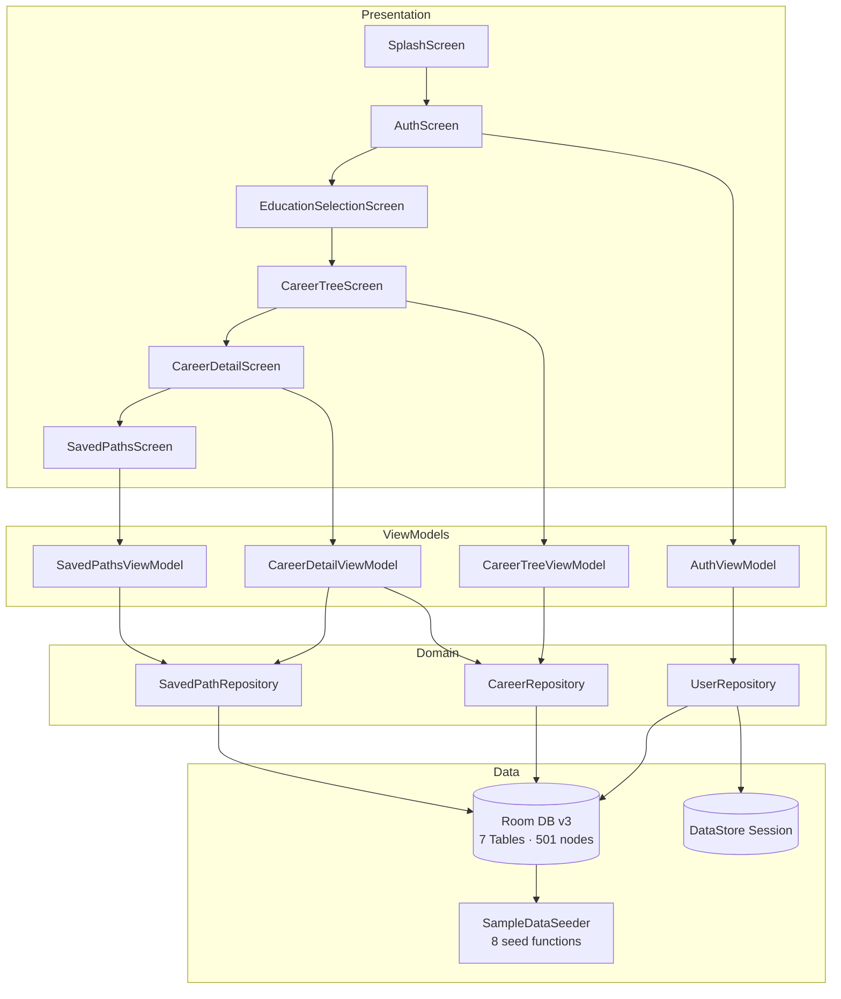

<div align="center">


# Future Guider

### *Explore Your Future, One Step At A Time*

[](https://kotlinlang.org)
[](https://developer.android.com)
[](https://developer.android.com/jetpack/compose)
[](https://m3.material.io)
[](https://developer.android.com/topic/architecture)
[](https://developer.android.com/training/data-storage/room)
[](https://dagger.dev/hilt)
[](LICENSE)

<br/>

> **Future Guider** is a production-ready Android career guidance app for Indian students — featuring an interactive expandable career tree, **501 career nodes**, **32 education categories**, and **224 in-depth career guides** — all working **completely offline**.

[📱 Download APK](#-build-instructions) · [🐛 Report Bug](../../issues) · [✨ Request Feature](../../issues)

</div>

---

## 📋 Table of Contents

- [About](#-about)
- [Screenshots](#-screenshots)
- [Key Features](#-key-features)
- [Technology Stack](#-technology-stack)
- [Architecture](#-architecture)
- [Project Structure](#-project-structure)
- [Career Data Overview](#-career-data-overview)
- [Installation](#-installation)
- [Build Instructions](#-build-instructions)
- [Navigation Flow](#-navigation-flow)
- [Database Design](#-database-design)
- [Security](#-security)
- [Performance](#-performance)
- [Roadmap](#-roadmap)
- [Contributing](#-contributing)
- [License](#-license)
- [Author](#-author)
- [FAQ](#-faq)
- [Changelog](#-changelog)

---

## 🎯 About

### The Problem
Millions of Indian students make life-defining career decisions without proper guidance. Career counsellors are expensive, online tools require internet, and no single app maps the full Indian education-to-career pathway in a student-friendly format.

### The Solution
**Future Guider** puts a complete career guidance system in every student's pocket — free, offline, and beautifully designed for dark and light mode.

| | |
|---|---|
| 🎯 **Target Users** | Indian students — Class 10 to Postgraduate level |
| 📶 **Internet Required** | ❌ None — 100% offline |
| 💰 **Cost** | Free |
| 📱 **Platform** | Android 5.0+ |

---

## 📱 Screenshots

### Splash Screen
<p align="center">
  
</p>

> The splash screen shows the **official Future Guider shield logo** with "EDUCATION" banner, pen nib, torch and star — exactly matching the brand.

---

### Education Selection Screen
<p align="center">
  
  &nbsp;&nbsp;
  
  &nbsp;&nbsp;
  
  &nbsp;&nbsp;
  
</p>

> Grouped into **7 sections**: After 10th · After 12th · Diploma/Vocational · Under Graduate · Post Graduate · Professional Courses · Career Paths. Each card shows emoji icon, name and subtitle. Personalised greeting shows the logged-in user's name.

---

### Career Tree Explorer
<p align="center">
  
  &nbsp;&nbsp;
  
  &nbsp;&nbsp;
  
</p>

> Tap any branch to **expand/collapse** it. Leaf careers show a "View Details →" button. Colour-coded by domain — blue for Software, gold for Hardware, purple for Emerging Tech.

---

### Saved Career Paths
<p align="center">
  
</p>

> Each saved path shows the **full breadcrumb trail** (e.g. 12th Science → Engineering → B.Tech CSE) with the date saved. Delete with the trash icon.

---

## ✨ Key Features

### 🌳 Interactive Career Tree Explorer
- Expandable/collapsible multi-level tree — tap any branch to explore
- Colour-coded nodes by career domain
- "View Details →" button on every leaf career
- Depth-indented layout with vertical connector lines
- Smooth expand/collapse animations

### 🗂️ 32 Education Categories

| Group | Categories |
|---|---|
| **After 10th** | 10th Passed |
| **After 12th** | 12th Science · 12th Commerce · 12th Arts |
| **Diploma / Vocational** | Diploma / ITI |
| **Under Graduate** | BCA · B.Sc · B.Com · B.Tech/BE · B.Ed |
| **Post Graduate** | MBA |
| **Professional Courses** | Hotel Management · Design Courses · Architecture · Agriculture · Law & Legal · Media & Journalism · Paramedical · Aviation · Marine & Merchant · Social Work · Finance & Accounts · Environmental Science · Veterinary Science · Library Science |
| **Career Paths** | Government Jobs · Defence & Military · Sports & Fitness · Entrepreneurship · Creative Arts · Healthcare Allied |

### 📚 224 Detailed Career Guides
Each leaf career includes:
- Full description with industry context and growth scope
- 6 domain-specific skills
- 3 practice projects with descriptions
- 3 certifications with issuing organisations
- Personalised next step with top colleges and entrance exams

### 🔐 User Authentication
- Register with name, email and password
- Passwords hashed with **SHA-256** before storage
- Session via **Jetpack DataStore** — auto-login on relaunch
- Logout accessible from home screen top bar

### 💾 Save & Manage Career Paths
- Bookmark any career with one tap
- Full breadcrumb trail on each saved card
- Date saved shown on every card
- Delete with trash icon

### 🎨 Professional UI
- Material Design 3 · Dark mode · Light mode
- 7 grouped category sections with coloured headers
- Stats bar: 32 Categories · 400+ Career Paths · 160+ Guides
- Hero banner: "Find Your Perfect Career Path"
- Animated pulse on splash logo
- Personalised greeting using saved username

---

## 🛠️ Technology Stack

| Layer | Technology | Version | Purpose |
|---|---|---|---|
| Language | **Kotlin** | 1.9.24 | Primary language |
| UI | **Jetpack Compose** | BOM 2024.06 | Declarative UI |
| Design | **Material Design 3** | Latest | Components and theming |
| Architecture | **MVVM + Clean Architecture** | — | Separation of concerns |
| DI | **Hilt** | 2.51.1 | Dependency injection |
| Database | **Room** | 2.6.1 | Offline structured storage |
| Session | **DataStore Preferences** | 1.1.1 | Key-value persistence |
| Navigation | **Navigation Compose** | 2.7.7 | Type-safe navigation |
| Async | **Kotlin Coroutines + Flow** | 1.8.1 | Background threading |
| State | **StateFlow** | — | Reactive UI state |
| Build | **Gradle KTS + KSP** | 8.4 / 1.9.24-1.0.20 | Build automation |

---

## 🏗️ Architecture

```
┌─────────────────────────────────────────────────────┐
│                  PRESENTATION LAYER                 │
│   Compose Screens → ViewModels → StateFlow<UiState> │
├─────────────────────────────────────────────────────┤
│                   DOMAIN LAYER                      │
│   Pure Kotlin Models · Repository Interfaces        │
├─────────────────────────────────────────────────────┤
│                    DATA LAYER                       │
│   Room DB · DAOs · Entities · DataStore · Mappers   │
└─────────────────────────────────────────────────────┘
```

### Architecture Diagram



---

## 📁 Project Structure

```
FutureGuider/
├── app/src/main/
│   ├── kotlin/com/futureguider/
│   │   ├── FutureGuiderApp.kt          # @HiltAndroidApp
│   │   ├── MainActivity.kt             # Single Activity + NavHost
│   │   ├── data/local/
│   │   │   ├── dao/                    # UserDao, CareerNodeDao, CareerDetailDao, SavedPathDao
│   │   │   ├── entities/               # 7 Room entity classes
│   │   │   ├── FutureGuiderDatabase.kt # Room DB v3, reseeds on open
│   │   │   ├── Mappers.kt              # Entity ↔ Domain converters
│   │   │   ├── SampleDataSeeder.kt     # 501 nodes, 224 bundles, 8 functions
│   │   │   └── UserPreferences.kt      # DataStore session
│   │   ├── data/repository/            # Repository implementations
│   │   ├── di/
│   │   │   ├── DatabaseModule.kt       # Room + DAO + Migration providers
│   │   │   └── RepositoryModule.kt     # Repository bindings
│   │   ├── domain/
│   │   │   ├── model/                  # Pure Kotlin models
│   │   │   └── usecase/                # Repository interfaces
│   │   └── presentation/
│   │       ├── navigation/             # NavHost + routes
│   │       ├── screens/
│   │       │   ├── splash/             # Logo + buttons
│   │       │   ├── auth/               # Register + Login
│   │       │   ├── education/          # 32-category grouped home
│   │       │   ├── careertree/         # Expandable tree
│   │       │   ├── careerdetails/      # Full career guide
│   │       │   └── savedpaths/         # Bookmarks
│   │       ├── theme/                  # Color, Typography, Shape
│   │       └── viewmodel/              # 4 ViewModels
│   └── res/
│       ├── drawable-nodpi/             # Full-res brand logo PNG
│       ├── mipmap-{mdpi..xxxhdpi}/     # Launcher icons at 5 densities
│       ├── values/                     # strings, colors, themes
│       └── xml/                        # Auto-backup rules
├── gradle/libs.versions.toml           # Centralised version catalog
├── gradle.properties                   # JVM 4096MB, parallel builds
└── README.md
```

---

## 📊 Career Data Overview

| Metric | Count |
|---|---|
| Root categories | 32 |
| Total career nodes | 501 |
| Detailed career guides | 224 |
| Skills documented | 1,344 |
| Certifications documented | 672 |
| Practice projects documented | 672 |
| Seed functions | 8 |
| Database version | 3 |

### Sample Trees Visible in Screenshots

**B.Tech / BE → Software Engineering:** Full Stack · Mobile App · DevOps · Cloud Architect

**B.Tech / BE → Hardware & Embedded:** Embedded Systems · VLSI Design · IoT Engineer

**B.Tech / BE → Emerging Tech:** AI/ML · Blockchain · AR/VR · Quantum Computing

**B.Tech / BE → Civil & Infrastructure:** Structural Engineer · Transportation · Geotechnical · Water Resources · Project Manager · Urban Planner

---

## ⚙️ Installation

### Prerequisites

| Requirement | Version |
|---|---|
| Android Studio | Hedgehog 2023.1.1+ |
| JDK | 11 or 17 |
| Android SDK | API 34 |
| Minimum Android | 5.0 (API 21) |
| Target Android | 14 (API 34) |

### Quick Start

```bash
git clone https://github.com/yourusername/FutureGuider.git
# File → Open in Android Studio → select FutureGuider folder
# Wait for Gradle sync → Press ▶ Run
```

---

## 🔨 Build Instructions

```bash
# Debug
./gradlew assembleDebug
# → app/build/outputs/apk/debug/app-debug.apk

# Release (signed)
keytool -genkey -v -keystore futureguider.jks -keyalg RSA -keysize 2048 -validity 10000 -alias futureguider
./gradlew assembleRelease
# → app/build/outputs/apk/release/app-release.apk

# Install directly on connected device
./gradlew installDebug

# Clean build
./gradlew clean assembleDebug
```

---

## 🗺️ Navigation Flow

```
App Launch → SplashScreen
                │
                ├── [Session active] ────────────► EducationSelectionScreen
                ├── [Get Started] → RegisterScreen ► EducationSelectionScreen
                └── [Login]       → LoginScreen    ► EducationSelectionScreen
                                                            │
                                                 [Select category]
                                                            │
                                                  CareerTreeScreen
                                                  [tap to expand nodes]
                                                            │
                                                 [Tap leaf → View Details]
                                                            │
                                                  CareerDetailScreen
                                                  [Save Path]
                                                            │
                                                  SavedPathsScreen
```

---

## 🗄️ Database Design

Room `future_guider.db` — v3, 7 tables:

```
users          → id, name, email (unique), passwordHash (SHA-256), createdAt
career_nodes   → id, name, parentId (nullable=root), type (ROOT|BRANCH|LEAF), colorHex
career_details → nodeId (PK/FK), description, suggestedNextStep
skills         → nodeId (FK), skillName
certifications → nodeId (FK), certName, provider
projects       → nodeId (FK), projectName, description
saved_paths    → id, userId (FK), leafNodeId (FK), pathJson (JSON), savedAt
```

**Auto-reseeding:** `onOpen` → `SampleDataSeeder.seed()` → `getCount() > 0` check → skips if data exists. Zero duplicates guaranteed.

---

## 🔐 Security

| Concern | Implementation |
|---|---|
| Passwords | SHA-256 hashed — plain text never stored |
| Session | DataStore with typed preference keys |
| SQL injection | Room uses parameterised queries only |
| Backup | Scoped to DB and preferences only |
| Network | Zero — no internet permission declared |

---

## ⚡ Performance

| Optimisation | Detail |
|---|---|
| Lazy tree loading | Children fetched only on node tap |
| Flow queries | Room emits only on data change |
| Stable Compose keys | Node ID used as key — no extra recomposition |
| KSP | 2× faster than KAPT |
| JVM heap | 4096 MB in `gradle.properties` |
| Parallel builds | `org.gradle.parallel=true` |

---

## 🛣️ Roadmap

### v2.0
- [ ] Full-text search across all 501 career nodes
- [ ] Career quiz with interest-based suggestions
- [ ] Entrance exam calendar (NEET, JEE, CLAT, GATE, UPSC)
- [ ] College finder with NIRF rankings
- [ ] Progress tracker

### v3.0
- [ ] Multi-language (Hindi, Kannada, Tamil, Telugu)
- [ ] On-device AI career recommendation
- [ ] Scholarship database
- [ ] Share career path as image
- [ ] Google Play Store release

---

## 🤝 Contributing

```bash
git checkout -b feature/your-feature-name
git commit -m "feat: describe your change"
git push origin feature/your-feature-name
# Open Pull Request on GitHub
```

**Guidelines:** Follow Clean Architecture · Use `StateFlow` · Add empty migrations on DB version bump · Test dark + light mode

---

## 📄 License

MIT License — Copyright (c) 2025 Future Guider. See [LICENSE](LICENSE) for full text.

---

## 👨‍💻 Author

<div align="center">

**Chandu** · Android Developer · India

Built with ❤️ to help every Indian student find their future

[](https://github.com/yourusername)

</div>

---

## ❓ FAQ

**Q: Does the app need internet?**
> No. 100% offline — all data bundled at install.

**Q: Data disappeared after reinstall?**
> Settings → Apps → Future Guider → Clear Data → reopen. DB reseeds automatically.

**Q: How to add more careers?**
> Add entries in `SampleDataSeeder.kt` using the `B()` pattern, bump DB version, add empty migration.

**Q: Minimum Android version?**
> Android 5.0 (API 21).

**Q: How to share the APK?**
> Build → Generate Signed Bundle/APK → APK → Release → share the `.apk` file.

---

## 📝 Changelog

### v1.0.0 — 2025
- 501 career tree nodes, 32 categories, 224 detailed guides
- User auth with SHA-256 password hashing + DataStore session
- Save and manage bookmarked career paths with full breadcrumb trail
- Material Design 3 with dark mode
- Official Future Guider shield logo
- 100% offline, Android Auto Backup enabled
- Database v3 with smooth migrations

---

## 📞 Support

🐛 Bugs → [Open an issue](../../issues/new) · 💡 Features → [Request here](../../issues/new) · 💬 Questions → [Discussions](../../discussions)

---

<div align="center">

**Future Guider** · Kotlin + Jetpack Compose · Made in India 🇮🇳

*Helping students explore 500+ career paths — completely offline*

⭐ **Star this repo** if Future Guider helped or inspired you!

</div>
